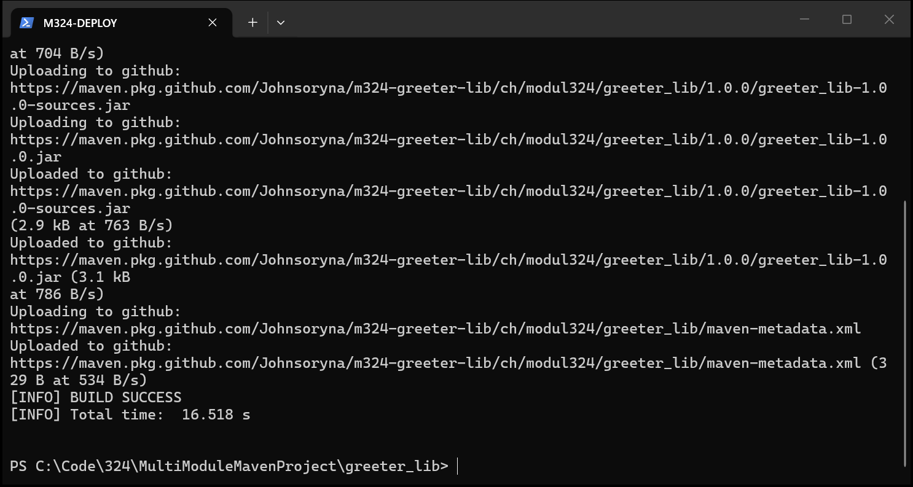
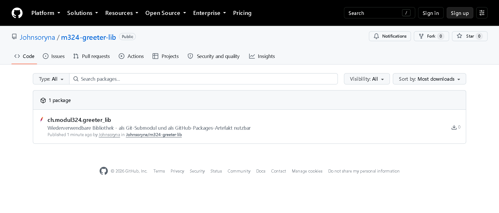
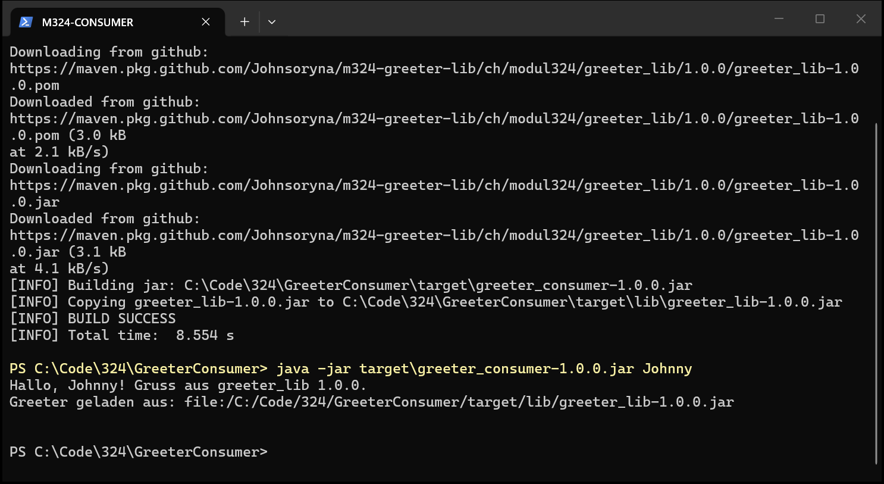
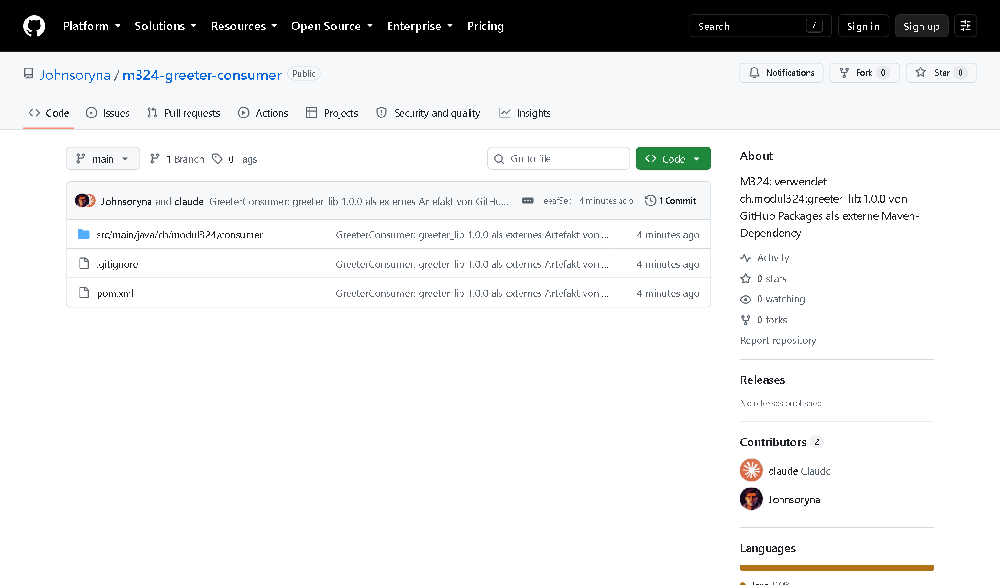

# M324 — Java Projekt und Artefakte / External Maven Module

| | |
|---|---|
| **Modul** | 324 — DevOps, Thema Module / Komponenten / Artefakte |
| **Autor** | Johnny Leonhardt |
| **Datum** | 10.09.2026 |
| **Repository Parent + app_main** | <https://github.com/Johnsoryna/m324-multimodule> |
| **Repository greeter_lib (Submodul + GitHub Package)** | <https://github.com/Johnsoryna/m324-greeter-lib> |
| **Repository Konsument (External Maven Module)** | <https://github.com/Johnsoryna/m324-greeter-consumer> |
| **Umgebung** | Windows 11, Temurin JDK 17.0.18, Maven 3.9.9, Git 2.48.1, IntelliJ IDEA 2024.3 |

Alle Befehle und Ausgaben in diesem Dokument wurden auf dem oben genannten Rechner tatsächlich ausgeführt.

---

## Aufgabe — Möglichkeiten ein Java Projekt zu modularisieren

| Ansatz | Ebene | Wozu es dient | Typische Dateien |
|---|---|---|---|
| **Maven** | Build / Dependency | Deklaratives Build-Modell, Multi-Module-Reaktor, transitive Abhängigkeiten | `pom.xml` |
| **Gradle** | Build / Dependency | Wie Maven, aber programmierbare DSL (Groovy/Kotlin), inkrementell, Build-Cache | `build.gradle(.kts)` |
| **Ant (+ Ivy)** | Build | Prozedurale Tasks; Dependency-Management nur mit Ivy | `build.xml`, `ivy.xml` |
| **IDE (IntelliJ / Eclipse)** | Projektstruktur | Module und Libraries in IDE-eigenen Dateien | `.iml`, `.idea/`, `.classpath` |
| **JPMS (Java 9+)** | Sprache / Laufzeit | Kapselung: was ist `exports`, was `requires` | `module-info.java` |
| **Git-Submodule** | Quellcode-Verwaltung | Fremdes Repository an einem festen Commit einhängen | `.gitmodules` |
| **Docker / Microservices** | Deployment | Jede Komponente als eigener Prozess | Container-Image |

**Verifikation des Begleitdokuments** — inhaltlich korrekt, aber an diesen Stellen zu kurz:

1. **JPMS ist keine Alternative zu Maven/Gradle.** JPMS regelt nur die Sichtbarkeit zur Compile- und Laufzeit, es lädt nichts aus einem Repository. In der Praxis wird es kombiniert: Maven holt das JAR, JPMS regelt die Kapselung. Die meisten Projekte nutzen JPMS bis heute nicht.
2. **Ant hat kein Dependency-Management.** Der eigentliche Unterschied ist nicht «weniger flexibel», sondern imperativ (Ant beschreibt *wie* gebaut wird) gegenüber deklarativ (Maven beschreibt *was* das Projekt ist). Für Abhängigkeiten braucht Ant zusätzlich Ivy.
3. **Git-Submodule sind kein Build-Mechanismus.** Sie liefern nur Quellcode an einer festen Commit-ID; gebaut wird trotzdem mit Maven oder Gradle.
4. **Fehlend: die binäre Abhängigkeit.** Der häufigste Weg in der Praxis ist, die Bibliothek als versioniertes Artefakt in ein Repository (Maven Central, Nexus, GitHub Packages) zu publizieren und nur noch als `<dependency>` zu referenzieren. Genau das wird in der letzten Aufgabe umgesetzt.
5. **Fehlend: BOM / Platform.** Bei vielen Modulen hält man Versionen zentral in `<dependencyManagement>` (Maven) bzw. `platform()` (Gradle) konsistent.

**Fazit:** Die Ansätze schliessen sich nicht aus, sie liegen auf verschiedenen Ebenen und werden kombiniert: Git-Submodul (welcher Code) → Maven (wie gebaut) → JPMS (was sichtbar, optional) → Docker (wie betrieben, optional).

---

## Aufgabe — Multi Module Maven Projekt und Git‑Submodul

### Teil 1 — Multi Module Maven Projekt

```
MultiModuleMavenProject/
├─ pom.xml                     ← Parent (packaging: pom), kein Code
├─ .gitmodules                 ← entsteht in Teil 2
├─ app_main/                   ← Anwendung mit main()
│  ├─ pom.xml
│  └─ src/main/java/ch/modul324/app/Main.java
└─ greeter_lib/                ← Bibliothek, eigenes Git-Repository (Submodul)
   ├─ pom.xml
   ├─ src/main/java/ch/modul324/greeter/Greeter.java
   └─ src/test/java/ch/modul324/greeter/GreeterTest.java
```


**Parent-POM** — `packaging pom`, definiert Reaktor und gemeinsame Einstellungen:

```xml
<groupId>ch.modul324</groupId>
<artifactId>multi-module-maven-project</artifactId>
<version>1.0-SNAPSHOT</version>
<packaging>pom</packaging>

<modules>
    <module>greeter_lib</module>
    <module>app_main</module>
</modules>

<properties>
    <maven.compiler.release>17</maven.compiler.release>
    <project.build.sourceEncoding>UTF-8</project.build.sourceEncoding>
</properties>

<dependencyManagement>          <!-- legt nur Versionen fest, fügt keine Abhängigkeit hinzu -->
    <dependencies>
        <dependency>
            <groupId>ch.modul324</groupId>
            <artifactId>greeter_lib</artifactId>
            <version>1.0.0</version>
        </dependency>
    </dependencies>
</dependencyManagement>
```

- `<modules>` steuert den Reaktor. Maven sortiert nach Abhängigkeiten, nicht nach Listenreihenfolge: `greeter_lib` wird vor `app_main` gebaut.
- Die Kindmodule erben über `<parent>` Properties und Plugin-Konfiguration. `app_main` referenziert `greeter_lib` **ohne** `<version>`, die kommt aus dem `<dependencyManagement>`.

**app_main/pom.xml** (Ausschnitt):

```xml
<parent>
    <groupId>ch.modul324</groupId>
    <artifactId>multi-module-maven-project</artifactId>
    <version>1.0-SNAPSHOT</version>
</parent>
<artifactId>app_main</artifactId>
<packaging>jar</packaging>

<dependencies>
    <dependency>
        <groupId>ch.modul324</groupId>
        <artifactId>greeter_lib</artifactId>
    </dependency>
</dependencies>
```

**Der Aufruf über die Modulgrenze** — `Main.java` verwendet die Klasse aus dem Submodul:

```java
import ch.modul324.greeter.Greeter;          // Klasse stammt aus greeter_lib

public static void main(String[] args) {
    String name = (args.length > 0) ? args[0] : "M324";
    System.out.println(new Greeter().greet(name));   // Aufruf der Submodul-Methode
}
```


**Build und Ausführung** — der Reaktor baut alle drei Projekte, die Tests der Bibliothek laufen mit:


Das `maven-jar-plugin` schreibt `Main-Class` und Classpath ins Manifest, das `maven-dependency-plugin` kopiert `greeter_lib-1.0.0.jar` nach `target/lib/`.

### Teil 2 — greeter_lib als Git-Submodul

**Ziel:** Parent + `app_main` in Repository A, `greeter_lib` in Repository B, B als Submodul in A.

**Schritt 1 — eigenes Repository für die Bibliothek:**

```bash
cd greeter_lib
git init -b main
git add .  &&  git commit -m "greeter_lib: eigenstaendige Bibliothek"
gh repo create m324-greeter-lib --public --source . --push
```

**Schritt 2 — Repository für Parent und app_main.** Wichtig: `greeter_lib/` darf hier *nicht* mitkommittiert werden, sonst liegt der Code doppelt und `git submodule add` schlägt fehl.

```bash
cd MultiModuleMavenProject
git init -b main
git add .gitignore pom.xml app_main doku          # greeter_lib bewusst NICHT
git commit -m "Parent-POM und Modul app_main"
gh repo create m324-multimodule --public --source . --push
```

**Schritt 3 — Submodul einhängen:**

```bash
git submodule add https://github.com/Johnsoryna/m324-greeter-lib.git greeter_lib
git commit -m "greeter_lib als Git-Submodul eingebunden"  &&  git push
```

`git submodule add` erzeugt die Datei `.gitmodules` **und** einen Index-Eintrag vom Typ `160000` (*gitlink*). Das Parent-Repository speichert **nicht den Code, sondern nur die Commit-ID** des Submoduls:


Auf GitHub erscheint `greeter_lib` im Parent-Repository nicht als Ordner, sondern als Link mit Commit-Hash (`greeter_lib @ f097d73`); ein Klick öffnet das Repository der Bibliothek:


**Nachweis: frischer Klon baut durch.** In einem leeren Verzeichnis wurde zweimal geklont:

| | `git clone <url>` | `git clone --recurse-submodules <url>` |
|---|---|---|
| Inhalt `greeter_lib/` | leer | `pom.xml`, `src/` |
| `mvn clean install` | `[ERROR] Child module ...\greeter_lib\pom.xml ... does not exist` | `BUILD SUCCESS`, `Tests run: 2` |
| Nachholen | `git submodule update --init --recursive` | — |

**Referenz aktualisieren.** Als `greeter_lib` später auf Version 1.0.0 gehoben wurde (letzte Aufgabe), brauchte es **zwei Commits**: erst im Submodul committen und pushen, dann im Parent den neuen Zeiger:

```bash
git add greeter_lib pom.xml
git commit -m "greeter_lib-Submodul auf Release 1.0.0 aktualisiert"  &&  git push
# gitlink alt: 1ed86d1  →  neu: f097d73
```

| Eigenschaft von Submodulen | Konsequenz |
|---|---|
| Parent speichert nur die Commit-ID | Stand ist eingefroren: reproduzierbar, aber nicht automatisch aktuell |
| Submodul steht im *detached HEAD* | Vor Änderungen `git checkout main` im Submodul |
| Änderungen brauchen zwei Commits | Erst Submodul, dann Parent (neuer gitlink) |
| Klonen ohne `--recurse-submodules` | Leeres Verzeichnis, Build schlägt fehl |

**Fazit:** Das Submodul löst die *Quellcode*-Verteilung, nicht die *Build*-Verteilung. Maven baut `greeter_lib` weiterhin als Reaktor-Modul mit. Der Alternativweg — fertiges Artefakt aus einem Maven-Repository — folgt in der letzten Aufgabe.

---

## Aufgabe — IDE‑Ansatz vs. Maven/Gradle

**A) Artefakt in IntelliJ IDEA einbinden, ohne Maven/Gradle**

1. JAR manuell beschaffen (z.B. von mvnrepository.com) und im Projekt unter `lib/` ablegen.
2. *File → Project Structure → Libraries → + → Java* → JAR wählen → Modul zuordnen.
3. Alternativ: *Modules → Dependencies → + → JARs or directories*.
4. Der Eintrag landet in `.idea/libraries/<name>.xml` und in der `.iml`-Datei des Moduls.
5. Eigenes Artefakt bauen: *Project Structure → Artifacts → + → JAR → From modules with dependencies*, dann *Build → Build Artifacts*; Ergebnis unter `out/artifacts/`, Konfiguration in `.idea/artifacts/`. (Referenz: jetbrains.com/help/idea/artifacts.html)

**B) Artefakt mit Maven / Gradle einbinden** — eine Deklaration, der Rest ist automatisch (Download aus Maven Central, lokales Repository, transitive Abhängigkeiten, Classpath für Compile/Test/Run; die IDE liest dieselbe Datei):

```xml
<dependency>                                 <!-- Maven, pom.xml -->
    <groupId>com.mysql</groupId>
    <artifactId>mysql-connector-j</artifactId>
    <version>8.4.0</version>
</dependency>
```
```groovy
implementation 'com.mysql:mysql-connector-j:8.4.0'   // Gradle, build.gradle
```

Eigenes Artefakt bauen: `mvn package` bzw. `gradle build`.

**C) Vergleich**

| Kriterium | IDE-Ansatz | Maven / Gradle |
|---|---|---|
| Reproduzierbarkeit | ✗ hängt an lokalen JARs und IDE-Konfiguration | ✓ Build-Datei beschreibt alles, versioniert |
| Transitive Abhängigkeiten | ✗ selbst suchen und einzeln hinzufügen | ✓ automatisch aufgelöst |
| CI/CD | ✗ Build-Server hat keine IDE | ✓ `mvn clean install` läuft überall gleich |
| Teamarbeit / IDE-Wechsel | ✗ jeder besorgt JARs selbst, Eclipse liest keine IntelliJ-Artifacts | ✓ jede IDE versteht Maven/Gradle |
| Sicherheit | ✗ kein Dependency-Baum, kein CVE-Scan | ✓ `dependency:tree`, Dependabot, OWASP-Check |
| Einstiegshürde | ✓ klicken, nichts zu lernen | ✗ Koordinaten, Lifecycle, Scopes lernen |
| Spezialfälle | ✓ exotische Paketierung per Klick | ~ braucht Plugins (shade, assembly) |

**D) Fazit:** Der IDE-Ansatz ist ein proprietärer Sonderweg, der nur auf diesem Rechner in dieser IDE funktioniert; sobald ein zweiter Mensch oder ein Build-Server dazukommt, bricht er. Maven und Gradle sind portabel und deklarativ, die Grundvoraussetzung für DevOps: eine Pipeline kann keine Maus bedienen. Den IDE-Weg nur für Wegwerf-Experimente; selbst für ein Alt-JAR ist `mvn install:install-file` die sauberere Lösung.

---

## Aufgabe — Refresher: Was ist ein Maven‑Artefakt?

Ein **Artefakt** ist das Ergebnis eines Maven-Builds: eine Datei (meist ein JAR) plus Metadaten, die in einem Repository abgelegt und über eindeutige Koordinaten gefunden wird.

| Begriff | Bedeutung | Beispiel aus diesem Projekt |
|---|---|---|
| **groupId** | Herausgeber (Organisation/Projekt), Konvention umgekehrter Domainname; wird im Repository zur Ordnerhierarchie | `ch.modul324` |
| **artifactId** | Name des einzelnen Artefakts innerhalb der Gruppe | `greeter_lib` |
| **version** | `MAJOR.MINOR.PATCH`, optional Suffix `-SNAPSHOT` | `1.0.0` |
| **packaging** | Typ und damit Dateiendung und Lifecycle: `jar` (Standard), `war`, `ear`, `pom`, `maven-plugin` | `jar` (Bibliothek), `pom` (Parent) |
| **classifier** | Optionaler Zusatz für mehrere Dateien mit gleichen GAV-Koordinaten | `sources`, `javadoc` |

groupId, artifactId und version heissen zusammen **GAV** und identifizieren das Artefakt eindeutig: `ch.modul324:greeter_lib:jar:1.0.0`.

**Aufbau — Pfad und Dateiname** werden mechanisch aus den Koordinaten abgeleitet:

```
<repository>/<groupId mit / statt .>/<artifactId>/<version>/<artifactId>-<version>[-<classifier>].<packaging>

~/.m2/repository/ch/modul324/greeter_lib/1.0.0/
├─ greeter_lib-1.0.0.jar            ← das Artefakt (Klassen, Ressourcen, MANIFEST.MF)
├─ greeter_lib-1.0.0-sources.jar    ← Classifier "sources" (maven-source-plugin)
├─ greeter_lib-1.0.0.pom            ← Metadaten: Koordinaten und eigene Abhängigkeiten
└─ _remote.repositories             ← woher das Artefakt stammt
```


Zu jedem Artefakt gehören immer mindestens **`.jar` und `.pom`**. Erst über das `.pom` kann Maven transitive Abhängigkeiten auflösen. Auf öffentlichen Repositories kommen Prüfsummen (`.sha1`, `.md5`) und bei Maven Central GPG-Signaturen (`.asc`) dazu.

**Release vs. Snapshot**

| | Release | Snapshot |
|---|---|---|
| Version | `1.0.0` | `1.0.0-SNAPSHOT` |
| Bedeutung | fertiger, freigegebener Stand | Entwicklungsstand, «in Arbeit» |
| Unveränderlich | **ja**, gleiche Version = für immer gleicher Inhalt | **nein**, wird bei jedem Deploy überschrieben |
| Update-Verhalten | einmal geladen, dann aus dem lokalen Repo | Maven prüft standardmässig täglich (`-U` erzwingt) |
| Dateiname im Remote-Repo | `greeter_lib-1.0.0.jar` | `greeter_lib-1.0-20260828.143512-7.jar` (Zeitstempel) |
| Einsatz | Produktion, Publikation | Entwicklung, CI-Zwischenstände |

Regel: Ein Release darf keine Snapshot-Abhängigkeiten enthalten, sonst ist der Build nicht reproduzierbar. Deshalb wurde `greeter_lib` vor der Publikation von `1.0-SNAPSHOT` auf `1.0.0` gehoben (letzte Aufgabe). Quelle: baeldung.com/maven-artifact

---

## Aufgabe — Lokales Maven‑Repository

**Zweck:** Ein Cache auf dem eigenen Rechner. Maven prüft bei jeder Abhängigkeit zuerst dort; nur was fehlt, wird aus dem Remote-Repository (Maven Central o.ä.) geladen und abgelegt. So wird jedes Artefakt nur **einmal pro Rechner** heruntergeladen. `mvn install` legt zudem die *eigenen* Artefakte dort ab, sodass andere lokale Projekte sie sofort nutzen können.

**Messung auf diesem Rechner**

| | |
|---|---|
| Pfad | `C:\Users\john-\.m2\repository` (Default; abfragbar mit `mvn help:evaluate -Dexpression=settings.localRepository -q -DforceStdout`) |
| Speicherbedarf | **347.8 MB (ca. 0.34 GB)** |
| Anzahl Dateien | 7190 |

```powershell
Get-ChildItem "$env:USERPROFILE\.m2\repository" -Recurse -File | Measure-Object -Property Length -Sum
```

Der Ordner wächst unbegrenzt und wird nie automatisch aufgeräumt; er darf jederzeit gelöscht werden, Maven lädt alles neu (nur nie publizierte `install`-Artefakte gehen verloren).

**Die settings.xml** (Quellen: baeldung.com/maven-local-repository, maven.apache.org/settings.html) — enthält alles, was **nicht** ins Projekt gehört: benutzer- und maschinenspezifische Einstellungen und vor allem **Zugangsdaten**. `pom.xml` beschreibt das Projekt (versioniert), `settings.xml` beschreibt die Umgebung (nie ins Git).

Zwei Ebenen: global in `<Maven-Home>/conf/settings.xml` (alle Benutzer der Installation) und pro Benutzer in `~/.m2/settings.xml` (gewinnt bei Konflikten).

| Element | Wofür |
|---|---|
| `localRepository` | anderer Pfad für das lokale Repository |
| `servers` | **Zugangsdaten** je Repository-`id` (Benutzer, Passwort/Token) |
| `mirrors` | Anfragen umleiten, z.B. alles über den Firmen-Nexus |
| `proxies` | HTTP-Proxy |
| `profiles` / `activeProfiles` | zusätzliche Repositories und Properties, per Profil aktivierbar |
| `offline`, `interactiveMode` | ohne Netz bauen, Rückfragen erlauben |

Die auf diesem Rechner für die letzte Aufgabe angelegte `~/.m2/settings.xml` (vorher existierte keine, Maven lief mit Defaults). Das Token steht nicht im Klartext in der Datei, sondern in einer Umgebungsvariable:

```xml
<settings xmlns="http://maven.apache.org/SETTINGS/1.0.0">
    <servers>
        <server>
            <id>github</id>                          <!-- muss zur id im POM passen -->
            <username>Johnsoryna</username>
            <password>${env.GITHUB_TOKEN}</password>
        </server>
    </servers>
</settings>
```


---

## Aufgabe — Artefakte zur Verfügung stellen

Publiziert wird immer mit `mvn deploy`. Das Ziel steht im POM unter `<distributionManagement>`, die Zugangsdaten in der `settings.xml`, verbunden über dieselbe `<id>`.

**1. Maven Central** — Account im Central Portal (central.sonatype.com), Namespace verifizieren (DNS-TXT auf eigener Domain oder `io.github.<user>` via GitHub), GPG-Schlüssel erzeugen und publizieren, POM vervollständigen (`name`, `description`, `url`, `licenses`, `developers`, `scm`), Sources- und Javadoc-JAR plus `maven-gpg-plugin` einbinden, `mvn deploy`, im Portal freigeben.

**2. Nexus / Artifactory** — Repository-Manager selbst betreiben (`docker run sonatype/nexus3`) oder gehostet, Repositories `releases`, `snapshots` und `proxy` für Central anlegen, Credentials in `settings.xml`, optional `<mirror>` auf die Public-Group, `<distributionManagement>` mit `repository` und `snapshotRepository`, `mvn deploy`.

**3. GitHub Packages** — Personal Access Token (classic) mit `write:packages`/`read:packages`, `<server id=github>` in `settings.xml`, `<distributionManagement>` auf `https://maven.pkg.github.com/<owner>/<repo>`, `mvn deploy`; Konsumenten tragen dieselbe URL unter `<repositories>` ein und brauchen ebenfalls ein Token. → In der nächsten Aufgabe durchgeführt.

**4. File-Sharing / Dateisystem** — Ordner mit Maven-Struktur auf Netzlaufwerk oder Webserver: `<distributionManagement><repository><url>file:///C:/maven-repo</url>`, `mvn deploy` schreibt direkt hinein. Noch simpler ohne Repository: `mvn install:install-file -Dfile=lib.jar -DgroupId=... -DartifactId=... -Dversion=... -Dpackaging=jar`.

| | Vorteile | Nachteile |
|---|---|---|
| **Maven Central** | weltweit ohne Zusatzkonfiguration erreichbar, kostenlos, höchste Glaubwürdigkeit | aufwändigste Einrichtung (Namespace, GPG, POM-Pflichtfelder); irreversibel, nur Releases, alles öffentlich |
| **Nexus / Artifactory** | volle Kontrolle und Rechte, Releases und Snapshots, Proxy-Cache für Central, Security-Scanning | Betrieb, Backup, Speicher und ggf. Lizenzkosten; für kleine Projekte überdimensioniert |
| **GitHub Packages** | direkt am Repository, keine Infrastruktur, kostenlos für Public, nahtlos mit GitHub Actions | **auch Public-Pakete brauchen beim Konsumenten ein Token**, GitHub-Bindung, Kontingente bei Private |
| **File-Sharing** | kein Server, keine Accounts, offline, in Minuten eingerichtet | keine Zugriffskontrolle, keine Prüfsummen, manuelle Verteilung, nicht CI-tauglich |

| Situation | Empfehlung |
|---|---|
| Öffentliche Open-Source-Bibliothek | Maven Central |
| Firmeninterner Code, mehrere Teams | Nexus / Artifactory |
| Projekt liegt ohnehin auf GitHub, kleines Team | GitHub Packages |
| Schulprojekt, Prototyp, Alt-JAR | Lokales Repository / `install-file` |

---

## Aufgabe — External Maven Module (GitHub Packages)

**Ziel:** `greeter_lib` als Maven-Artefakt auf GitHub Packages publizieren und in einem **anderen, unabhängigen Projekt** als externe Dependency verwenden, ohne Submodul und ohne Quellcode der Bibliothek.

### Schritt 1 — Repository auf GitHub

Verwendet wird das bestehende Repository `github.com/Johnsoryna/m324-greeter-lib` mit der Struktur `pom.xml`, `src/main/java`, `src/test/java`.

### Schritt 2 — pom.xml der Bibliothek

Zwei Dinge mussten geändert werden. Erstens **kein Snapshot**: Version `1.0-SNAPSHOT` → `1.0.0`. Zweitens **kein `<parent>`**: Das bisherige POM erbte vom Parent `multi-module-maven-project:1.0-SNAPSHOT`. Ein deploytes POM mit diesem Parent wäre für Konsumenten nicht auflösbar, weil der Parent in keinem Remote-Repository existiert. `greeter_lib` ist jetzt ein vollständig eigenständiges Artefakt mit eigenen Properties und Plugins; im Multi-Module-Projekt funktioniert es weiterhin als Reaktor-Modul (siehe Reactor Summary oben: `Greeter Library 1.0.0`).

```xml
<groupId>ch.modul324</groupId>
<artifactId>greeter_lib</artifactId>
<version>1.0.0</version>                 <!-- Release, kein SNAPSHOT -->
<packaging>jar</packaging>

<properties>
    <maven.compiler.release>17</maven.compiler.release>
    <project.build.sourceEncoding>UTF-8</project.build.sourceEncoding>
</properties>
```

Die Koordinaten sind eindeutig: GitHub Packages ist pro Owner und Repository getrennt, `ch.modul324:greeter_lib` existiert nur unter `Johnsoryna/m324-greeter-lib`.

### Schritt 3 — GitHub Packages als Ziel definieren

Die URL leitet sich aus dem Repository-Namen ab:

```xml
<distributionManagement>
    <repository>
        <id>github</id>
        <name>GitHub Packages</name>
        <url>https://maven.pkg.github.com/Johnsoryna/m324-greeter-lib</url>
    </repository>
</distributionManagement>
```

### Schritt 4 — Zugangsdaten

Token mit den Scopes `write:packages` und `read:packages`, hier über die GitHub CLI erzeugt statt über die Web-Oberfläche (`gh auth refresh -s write:packages,read:packages`; das Token liefert `gh auth token`). Die `~/.m2/settings.xml` (siehe Aufgabe Lokales Repository) verweist mit `${env.GITHUB_TOKEN}` auf die Umgebungsvariable. Prüfung:

```
PS> $env:GITHUB_TOKEN = (gh auth token)
PS> mvn help:effective-settings
Effective user-specific configuration settings:
<settings xmlns="http://maven.apache.org/SETTINGS/1.2.0" ...>
  <servers>
    <server>
      <username>Johnsoryna</username>
      <password>***</password>
      <id>github</id>
    </server>
  </servers>
</settings>
[INFO] BUILD SUCCESS
```

### Schritt 5 — Artefakt publizieren

```
PS C:\Code\324\MultiModuleMavenProject\greeter_lib> mvn clean deploy
[INFO] Building Greeter Library 1.0.0
[INFO] Tests run: 2, Failures: 0, Errors: 0, Skipped: 0
[INFO] Building jar: ...\greeter_lib\target\greeter_lib-1.0.0.jar
[INFO] Building jar: ...\greeter_lib\target\greeter_lib-1.0.0-sources.jar
Uploading to github: https://maven.pkg.github.com/Johnsoryna/m324-greeter-lib/ch/modul324/greeter_lib/1.0.0/greeter_lib-1.0.0.pom
Uploaded to github:  https://maven.pkg.github.com/Johnsoryna/m324-greeter-lib/ch/modul324/greeter_lib/1.0.0/greeter_lib-1.0.0.pom (3.0 kB at 704 B/s)
Uploaded to github:  https://maven.pkg.github.com/Johnsoryna/m324-greeter-lib/ch/modul324/greeter_lib/1.0.0/greeter_lib-1.0.0-sources.jar (2.9 kB at 763 B/s)
Uploaded to github:  https://maven.pkg.github.com/Johnsoryna/m324-greeter-lib/ch/modul324/greeter_lib/1.0.0/greeter_lib-1.0.0.jar (3.1 kB at 786 B/s)
Uploaded to github:  https://maven.pkg.github.com/Johnsoryna/m324-greeter-lib/ch/modul324/greeter_lib/maven-metadata.xml (329 B at 534 B/s)
[INFO] BUILD SUCCESS
[INFO] Total time:  16.518 s
```



Das Package erscheint im Repository unter *Packages*:



### Schritt 6 — Das Modul in einem anderen Projekt verwenden

Neues, unabhängiges Projekt `GreeterConsumer` (Repository `Johnsoryna/m324-greeter-consumer`): nur `pom.xml` und eine Klasse, **kein** Submodul, **kein** Code von `greeter_lib`.

```
GreeterConsumer/
├─ pom.xml
└─ src/main/java/ch/modul324/consumer/ConsumerApp.java
```

`pom.xml` — Maven kennt standardmässig nur Maven Central, deshalb muss das GitHub-Repository eingetragen werden; die `id` verweist wieder auf die Zugangsdaten in der `settings.xml`:

```xml
<repositories>
    <repository>
        <id>github</id>
        <url>https://maven.pkg.github.com/Johnsoryna/m324-greeter-lib</url>
    </repository>
</repositories>

<dependencies>
    <dependency>
        <groupId>ch.modul324</groupId>
        <artifactId>greeter_lib</artifactId>
        <version>1.0.0</version>
    </dependency>
</dependencies>
```

`ConsumerApp.java` — ruft die Methode aus dem externen Modul auf und gibt zusätzlich aus, aus welchem JAR die Klasse geladen wurde:

```java
import ch.modul324.greeter.Greeter;   // aus dem externen Artefakt ch.modul324:greeter_lib:1.0.0

public static void main(String[] args) {
    String name = (args.length > 0) ? args[0] : "M324";
    System.out.println(new Greeter().greet(name));
    System.out.println("Greeter geladen aus: "
            + Greeter.class.getProtectionDomain().getCodeSource().getLocation());
}
```

**Nachweis, dass der Download von GitHub funktioniert.** Weil `greeter_lib` durch `mvn install` bereits im lokalen Repository lag, wurde es dort gelöscht und der Build mit `-U` erzwungen:

```
PS> Remove-Item -Recurse "$env:USERPROFILE\.m2\repository\ch\modul324\greeter_lib"
PS C:\Code\324\GreeterConsumer> mvn -U -e clean package
[INFO] Building Greeter Consumer 1.0.0
Downloading from github: https://maven.pkg.github.com/Johnsoryna/m324-greeter-lib/ch/modul324/greeter_lib/1.0.0/greeter_lib-1.0.0.pom
Downloaded from github:  https://maven.pkg.github.com/Johnsoryna/m324-greeter-lib/ch/modul324/greeter_lib/1.0.0/greeter_lib-1.0.0.pom (3.0 kB at 2.1 kB/s)
Downloading from github: https://maven.pkg.github.com/Johnsoryna/m324-greeter-lib/ch/modul324/greeter_lib/1.0.0/greeter_lib-1.0.0.jar
Downloaded from github:  https://maven.pkg.github.com/Johnsoryna/m324-greeter-lib/ch/modul324/greeter_lib/1.0.0/greeter_lib-1.0.0.jar (3.1 kB at 4.1 kB/s)
[INFO] Building jar: C:\Code\324\GreeterConsumer\target\greeter_consumer-1.0.0.jar
[INFO] Copying greeter_lib-1.0.0.jar to C:\Code\324\GreeterConsumer\target\lib\greeter_lib-1.0.0.jar
[INFO] BUILD SUCCESS
[INFO] Total time:  8.554 s

PS C:\Code\324\GreeterConsumer> java -jar target\greeter_consumer-1.0.0.jar Johnny
Hallo, Johnny! Gruss aus greeter_lib 1.0.0.
Greeter geladen aus: file:/C:/Code/324/GreeterConsumer/target/lib/greeter_lib-1.0.0.jar
```



**Gegenprobe ohne Token** (`GITHUB_TOKEN` leer): GitHub Packages verlangt auch für öffentliche Pakete eine Authentifizierung.

```
PS C:\Code\324\GreeterConsumer> $env:GITHUB_TOKEN = ""
PS C:\Code\324\GreeterConsumer> mvn -U clean package
[ERROR] Failed to execute goal on project greeter_consumer: Could not collect dependencies
        for project ch.modul324:greeter_consumer:jar:1.0.0
[ERROR] Failed to read artifact descriptor for ch.modul324:greeter_lib:jar:1.0.0
[ERROR]   Caused by: Could not transfer artifact ch.modul324:greeter_lib:pom:1.0.0 from/to github
        (https://maven.pkg.github.com/Johnsoryna/m324-greeter-lib): status code: 401, reason phrase: Unauthorized (401)
```



### Erkenntnisse

- **Submodul vs. Artefakt:** Das Submodul liefert Quellcode und baut ihn bei jedem Konsumenten neu; das publizierte Artefakt wird einmal gebaut und nur noch als Binärdatei mit Versionsnummer bezogen. Release-Zyklen sind damit entkoppelt.
- **Kein Snapshot, kein Parent:** Ein publiziertes Artefakt muss für sich allein auflösbar und unveränderlich sein.
- **Token auch zum Lesen:** Der grösste Nachteil von GitHub Packages; für echte Open-Source-Bibliotheken ist Maven Central die bessere Wahl.
- **Dieselbe `<id>` an drei Stellen:** `distributionManagement` (Publizieren), `repositories` (Konsumieren) und `servers` in der `settings.xml` (Zugangsdaten) müssen zusammenpassen, sonst gibt es `401 Unauthorized`.

---

## Quellen

- Baeldung — What Is a Maven Artifact?: <https://www.baeldung.com/maven-artifact>
- Baeldung — Guide to the Maven Local Repository: <https://www.baeldung.com/maven-local-repository>
- Pro Git — Git Tools: Submodules: <https://git-scm.com/book/en/v2/Git-Tools-Submodules>
- JetBrains — Artifacts (IntelliJ IDEA): <https://www.jetbrains.com/help/idea/artifacts.html>
- Apache Maven — Settings Reference: <https://maven.apache.org/settings.html>
- GitHub Docs — Working with the Apache Maven registry: <https://docs.github.com/packages/working-with-a-github-packages-registry/working-with-the-apache-maven-registry>
- Sonatype Central Portal: <https://central.sonatype.com/>
- Maven Repository Search: <https://mvnrepository.com/>
