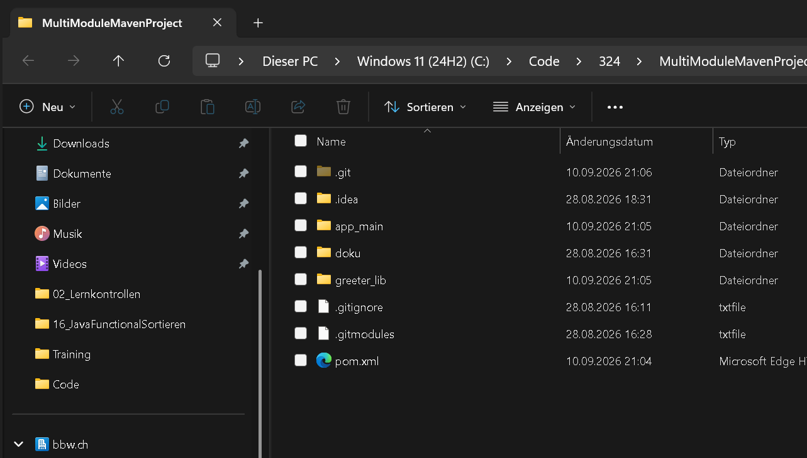
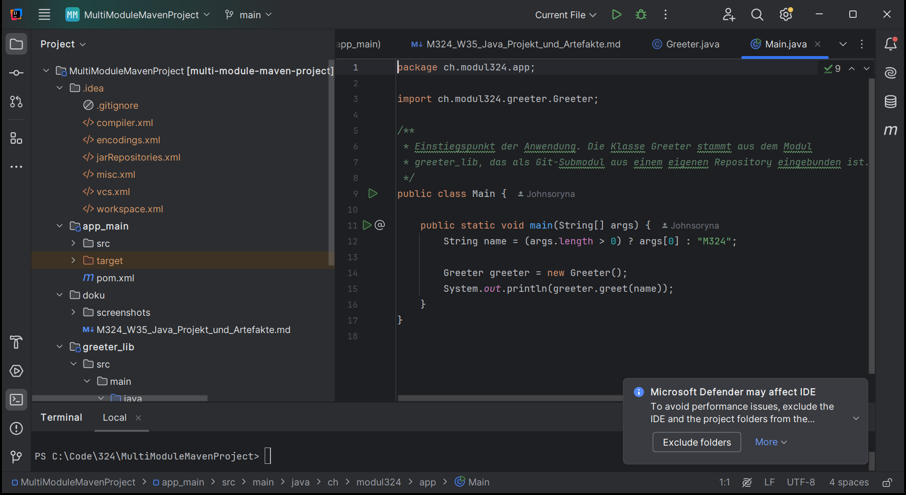
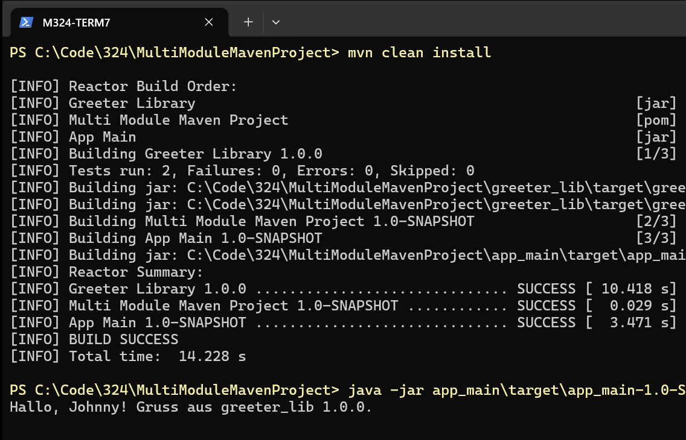
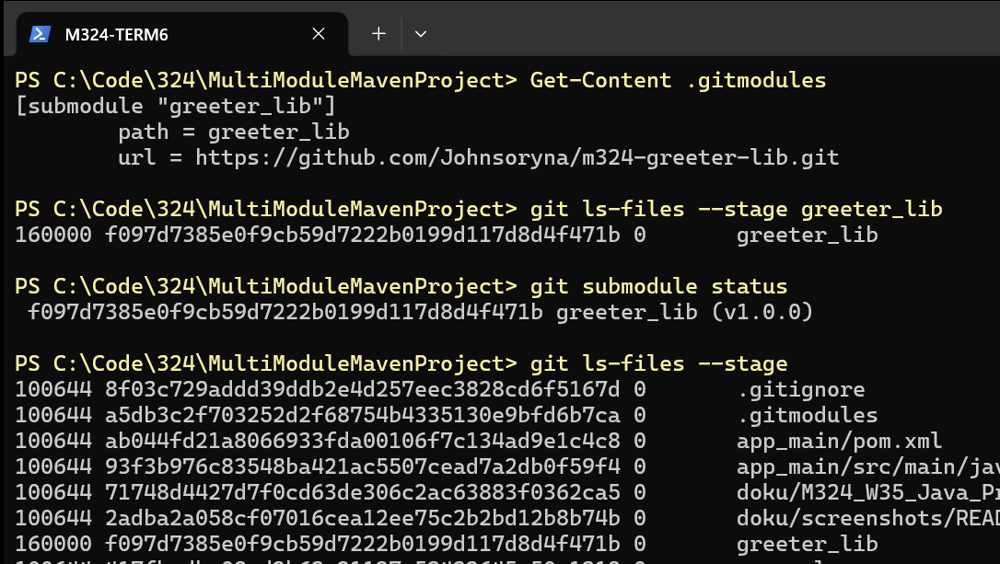
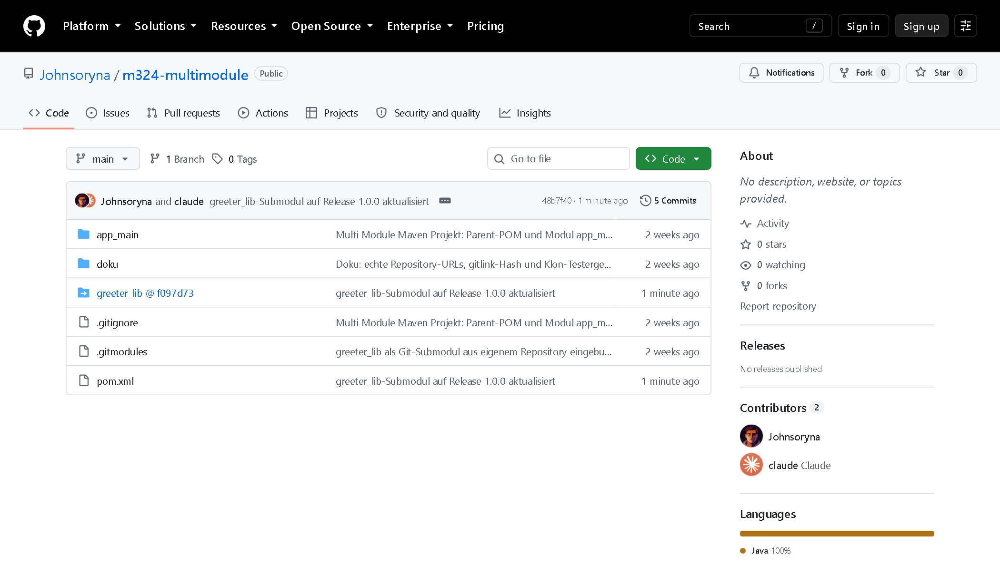
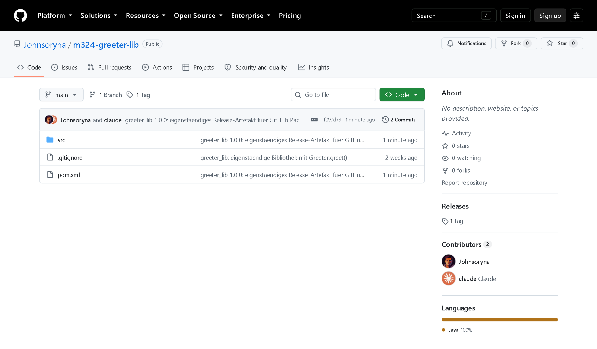
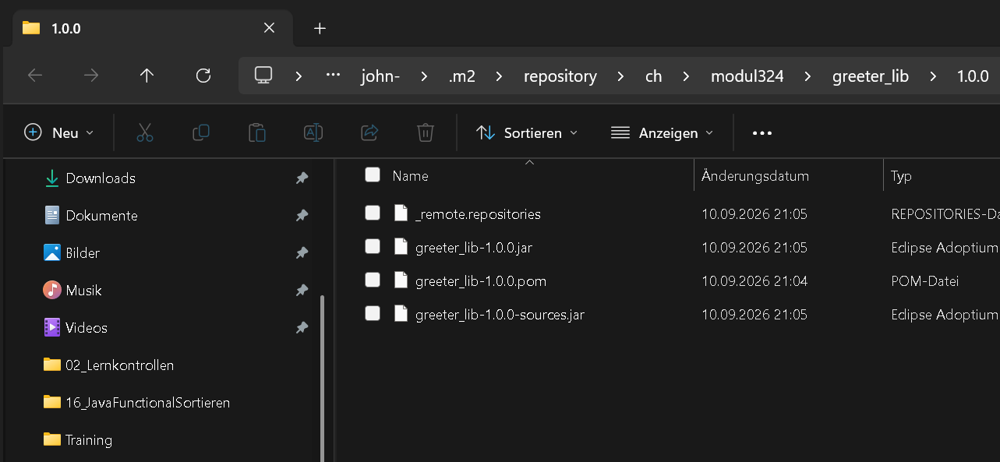

# M324 — Java Projekt und Artefakte

| | |
|---|---|
| **Modul** | 324 — DevOps |
| **Thema** | Module / Komponenten / Artefakte — Java Projekt mit Modulen |
| **Woche** | 35 |
| **Datum** | 28.08.2026 |
| **Autor** | Johnny Leonhardt |
| **Projekt** | `C:\Code\324\MultiModuleMavenProject` |

**Umgebung, in der alle Befehle dieses Dokuments ausgeführt wurden**

| Werkzeug | Version / Pfad |
|---|---|
| Betriebssystem | Windows 11 Home (10.0.26200) |
| JDK | Eclipse Temurin 17.0.18+8 |
| Apache Maven | 3.9.9 (`C:\ProgramData\chocolatey\lib\maven\apache-maven-3.9.9`) |
| Git | 2.48.1.windows.1 |
| IDE | IntelliJ IDEA 2024.3 |
| GitHub CLI | `C:\Program Files\GitHub CLI\gh.exe` |

---

## Aufgabe — Möglichkeiten ein Java Projekt zu modularisieren

### Überblick der Ansätze

| Ansatz | Ebene | Wozu es dient | Typische Artefakte |
|---|---|---|---|
| **Maven** | Build / Dependency | Deklaratives Build-Modell, Multi-Module-Reaktor, transitive Abhängigkeiten | `pom.xml`, JAR/WAR |
| **Gradle** | Build / Dependency | Wie Maven, aber programmierbare DSL (Groovy/Kotlin), inkrementell und mit Build-Cache | `build.gradle(.kts)`, `settings.gradle` |
| **Ant (+ Ivy)** | Build | Prozedurale Task-Beschreibung; Ant selbst kennt keine Abhängigkeitsauflösung — dafür braucht es Ivy | `build.xml`, `ivy.xml` |
| **IDE (IntelliJ / Eclipse)** | Projektstruktur | Module und Libraries werden in IDE-eigenen Dateien beschrieben | `.iml`, `.idea/`, `.classpath` |
| **JPMS (Java 9+)** | Sprache / Laufzeit | Kapselung zur Compile- und Laufzeit: was ist `exported`, was `required` | `module-info.java` |
| **Git-Submodule** | Quellcode-Verwaltung | Ein fremdes Repository in einem definierten Commit ins eigene einhängen | `.gitmodules` |
| **Docker / Microservices** | Deployment / Laufzeit | Jede Komponente als eigener Prozess mit eigenem Lebenszyklus | Container-Image |

### Verifikation und Ergänzungen zum Begleitdokument

Der Text der Knowledge Base ist inhaltlich korrekt, greift aber an drei Stellen zu kurz:

1. **JPMS ist keine Alternative zu Maven/Gradle**, sondern liegt auf einer anderen Ebene. JPMS beschreibt *Sichtbarkeit* zur Compile- und Laufzeit (`exports`, `requires`), löst aber keine Abhängigkeiten auf und lädt nichts aus einem Repository herunter. In der Praxis kombiniert man beides: Maven holt das JAR, JPMS regelt, welche Pakete daraus sichtbar sind. Wer nur modularisieren will, braucht JPMS nicht — die grosse Mehrheit der Java-Projekte nutzt es bis heute nicht.
2. **Ant kann von sich aus keine Abhängigkeiten verwalten.** Der Begleittext stellt Ant als „weniger flexibel" dar; der eigentliche Unterschied ist ein anderer: Ant beschreibt *wie* gebaut wird (imperativ), Maven beschreibt *was* das Projekt ist (deklarativ, Convention over Configuration). Für Dependency-Management braucht Ant zusätzlich Apache Ivy.
3. **Git-Submodule sind kein Build-Mechanismus.** Sie liefern nur Quellcode an einer festen Commit-ID; zusammengebaut wird trotzdem mit Maven oder Gradle. Sie sind damit eine Ergänzung zum Build-Tool, keine Alternative — genau diese Kombination wird in der nächsten Aufgabe umgesetzt.

Zwei im Begleitdokument fehlende Punkte:

4. **Binäre Abhängigkeit statt Quellcode-Abhängigkeit.** Der in der Praxis häufigste Weg ist gar keiner der genannten: Die Bibliothek wird als versioniertes Artefakt in ein Repository (Nexus, Artifactory, GitHub Packages, Maven Central) veröffentlicht und im Zielprojekt nur noch als `<dependency>` referenziert. Das entkoppelt die Release-Zyklen vollständig — Konsumenten müssen den Quellcode weder auschecken noch bauen.
5. **BOM / Platform.** Bei vielen Modulen hält man Versionen zentral über eine „Bill of Materials" konsistent (`<dependencyManagement>` in Maven, `platform()` in Gradle). Genau das nutzt das Parent-POM in diesem Projekt.

### Fazit

Die Ansätze schliessen sich nicht aus, sie liegen auf verschiedenen Ebenen und werden kombiniert:

```
Quellcode-Ebene   →  Git-Submodul   (welcher Code, welcher Commit)
Build-Ebene       →  Maven          (wie wird kompiliert, welche Abhängigkeiten)
Sprach-Ebene      →  JPMS           (was ist nach aussen sichtbar)  [optional]
Deployment-Ebene  →  Docker         (wie läuft es in Produktion)   [optional]
```

---

## Aufgabe — Multi Module Maven Projekt und Git‑Submodul

### Teil 1 — Multi Module Maven Projekt

#### Projektstruktur

```
MultiModuleMavenProject/
├─ pom.xml                     ← Parent (packaging: pom)
├─ .gitmodules                 ← entsteht in Teil 2
├─ app_main/
│  ├─ pom.xml
│  └─ src/main/java/ch/modul324/app/Main.java
└─ greeter_lib/                ← Git-Submodul (eigenes Repository)
   ├─ pom.xml
   ├─ src/main/java/ch/modul324/greeter/Greeter.java
   └─ src/test/java/ch/modul324/greeter/GreeterTest.java
```



#### Das Parent-POM

Das Parent-Projekt enthält **keinen** Code. Sein `packaging` ist `pom`, es dient nur als Reaktor (Baureihenfolge) und als zentrale Stelle für Versionen.

```xml
<groupId>ch.modul324</groupId>
<artifactId>multi-module-maven-project</artifactId>
<version>1.0-SNAPSHOT</version>
<packaging>pom</packaging>

<modules>
    <module>greeter_lib</module>
    <module>app_main</module>
</modules>

<properties>
    <maven.compiler.release>17</maven.compiler.release>
    <project.build.sourceEncoding>UTF-8</project.build.sourceEncoding>
</properties>

<dependencyManagement>
    <dependencies>
        <dependency>
            <groupId>ch.modul324</groupId>
            <artifactId>greeter_lib</artifactId>
            <version>${project.version}</version>
        </dependency>
    </dependencies>
</dependencyManagement>
```

Wichtig zu verstehen:

- **`<modules>`** steuert den Reaktor. Maven sortiert die Module *nicht* nach der Reihenfolge in der Liste, sondern nach ihren Abhängigkeiten: `greeter_lib` wird vor `app_main` gebaut, weil `app_main` davon abhängt.
- **`<dependencyManagement>`** legt nur Versionen fest, es fügt keine Abhängigkeit hinzu. Die Kindmodule referenzieren danach ohne `<version>`.
- Die Kindmodule erben über den `<parent>`-Block Properties, Plugin-Konfiguration und Repository-Einstellungen.

#### Die Kindmodule

`greeter_lib/pom.xml` — die wiederverwendbare Bibliothek:

```xml
<parent>
    <groupId>ch.modul324</groupId>
    <artifactId>multi-module-maven-project</artifactId>
    <version>1.0-SNAPSHOT</version>
</parent>

<artifactId>greeter_lib</artifactId>
<packaging>jar</packaging>
```

`app_main/pom.xml` — die Anwendung, die das Artefakt konsumiert (ohne `<version>`, die kommt aus dem `<dependencyManagement>` des Parents):

```xml
<dependencies>
    <dependency>
        <groupId>ch.modul324</groupId>
        <artifactId>greeter_lib</artifactId>
    </dependency>
</dependencies>
```

#### Der Code über die Modulgrenze hinweg

`greeter_lib/src/main/java/ch/modul324/greeter/Greeter.java`:

```java
package ch.modul324.greeter;

public class Greeter {
    public String greet(String name) {
        String target = (name == null || name.isBlank()) ? "Welt" : name.trim();
        return "Hallo, " + target + "! Gruss aus dem greeter_lib Submodul.";
    }
}
```

`app_main/src/main/java/ch/modul324/app/Main.java` — hier wird die Methode **aus dem Submodul** aufgerufen:

```java
package ch.modul324.app;

import ch.modul324.greeter.Greeter;   // ← Klasse stammt aus dem Submodul

public class Main {
    public static void main(String[] args) {
        String name = (args.length > 0) ? args[0] : "M324";
        Greeter greeter = new Greeter();
        System.out.println(greeter.greet(name));   // ← Aufruf der Submodul-Methode
    }
}
```



#### Build und Ausführung

```
PS C:\Code\324\MultiModuleMavenProject> mvn clean install
```

Der Reaktor baut alle drei Projekte:

```
[INFO] Reactor Summary:
[INFO] Multi Module Maven Project 1.0-SNAPSHOT ........... SUCCESS
[INFO] Greeter Library ................................... SUCCESS
[INFO] App Main .......................................... SUCCESS
[INFO] BUILD SUCCESS
```



Ausführen des erzeugten JAR:

```
PS> java -jar app_main\target\app_main-1.0-SNAPSHOT.jar Johnny
Hallo, Johnny! Gruss aus dem greeter_lib Submodul.
```

Damit das funktioniert, setzt das `maven-jar-plugin` die `Main-Class` ins Manifest, und das `maven-dependency-plugin` kopiert `greeter_lib-1.0-SNAPSHOT.jar` nach `target/lib/`, wohin der Manifest-Classpath zeigt.


> **Hinweis zum Öffnen in IntelliJ:** Nicht den Ordner öffnen, sondern über *File → Open* die **`pom.xml` des Parents** auswählen und „Open as Project" bestätigen. IntelliJ liest dann den Reaktor und legt beide Kindmodule automatisch als IDE-Module an.

### Teil 2 — greeter_lib als Git-Submodul

**Ziel:** Parent-Projekt und `app_main` liegen in Repository A, `greeter_lib` in einem eigenen Repository B. B wird als Submodul in A eingehängt.

#### Schritt 1 — Eigenes Repository für die Bibliothek

```bash
cd C:\Code\324\MultiModuleMavenProject\greeter_lib
git init -b main
git add .
git commit -m "greeter_lib: eigenstaendige Bibliothek mit Greeter.greet()"
gh repo create m324-greeter-lib --public --source . --push
```

#### Schritt 2 — Repository für Parent und app_main

Hier ist die **Reihenfolge entscheidend**: `greeter_lib/` darf im Parent-Repository *nicht* mitkommittiert werden, sonst liegt der Code doppelt in der Historie und der spätere `git submodule add` schlägt fehl.

```bash
cd C:\Code\324\MultiModuleMavenProject
git init -b main
git add .gitignore pom.xml app_main doku      # greeter_lib bewusst NICHT
git commit -m "Multi Module Maven Projekt: Parent-POM und Modul app_main"
gh repo create m324-multimodule --public --source . --push
```

#### Schritt 3 — Submodul einhängen

Das Verzeichnis `greeter_lib/` wird gelöscht (der Inhalt liegt bereits sicher auf GitHub) und danach als Submodul wieder eingehängt:

```bash
rm -rf greeter_lib
git submodule add https://github.com/<GITHUB-USER>/m324-greeter-lib.git greeter_lib
git commit -m "greeter_lib als Git-Submodul eingebunden"
git push
```

`git submodule add` erzeugt dabei zwei Dinge:

**1. Die Datei `.gitmodules`** (im Repository versioniert):

```ini
[submodule "greeter_lib"]
	path = greeter_lib
	url = https://github.com/<GITHUB-USER>/m324-greeter-lib.git
```

**2. Einen Index-Eintrag vom Typ `160000` (gitlink)** — das ist der Kern des Mechanismus: Das Parent-Repository speichert **nicht den Code**, sondern **nur die Commit-ID**, auf der das Submodul steht.

```
$ git ls-files --stage greeter_lib
160000 1ed86d1... 0	greeter_lib

$ git submodule status
 1ed86d1... greeter_lib (heads/main)
```





Auf GitHub erscheint `greeter_lib` im Parent-Repository nicht als Ordner, sondern als **Link mit Commit-Hash** (`greeter_lib @ 1ed86d1`).

#### Schritt 4 — Nachweis: frischer Klon baut durch

Ein normaler `git clone` holt das Submodul **leer**. Das ist der wichtigste Stolperstein:

```bash
git clone https://github.com/<GITHUB-USER>/m324-multimodule.git test
cd test && ls greeter_lib     # → leer, Build schlägt fehl
```

Richtig ist eine der beiden Varianten:

```bash
# Variante A: direkt beim Klonen
git clone --recurse-submodules https://github.com/<GITHUB-USER>/m324-multimodule.git

# Variante B: nachträglich
git submodule update --init --recursive
```

Danach läuft `mvn clean install` im frischen Klon durch — der Beweis, dass das Projekt vollständig über das Submodul baut.

#### Wichtige Eigenschaften von Submodulen

| Verhalten | Konsequenz für die Arbeit |
|---|---|
| Das Parent speichert nur die Commit-ID, nicht den Code | Das Submodul ist auf einen Stand **eingefroren** — reproduzierbar, aber nicht automatisch aktuell |
| Das Submodul steht im *detached HEAD* | Vor dem Ändern zuerst `git checkout main` im Submodul, sonst gehen Commits verloren |
| Änderungen brauchen **zwei** Commits | Erst im Submodul committen und pushen, dann im Parent den neuen Zeiger committen |
| Update auf den neusten Stand | `git submodule update --remote greeter_lib`, danach im Parent committen |
| Klonen ohne `--recurse-submodules` | Leeres Verzeichnis, Build schlägt fehl |

**Fazit:** Das Git-Submodul löst die *Quellcode*-Verteilung, nicht die *Build*-Verteilung. Maven baut `greeter_lib` weiterhin als Reaktor-Modul mit. Der Alternativweg — `greeter_lib` als fertiges Artefakt in ein Maven-Repository veröffentlichen und nur noch als `<dependency>` referenzieren — ist Thema der letzten Aufgabe.

---

## Aufgabe — IDE‑Ansatz vs. Maven/Gradle

### A) Artefakt in IntelliJ IDEA einbinden — ohne Maven/Gradle

**Ein fremdes JAR als Abhängigkeit hinzufügen:**

1. JAR-Datei manuell beschaffen (z.B. von [mvnrepository.com](https://mvnrepository.com/) herunterladen) und im Projekt ablegen, üblicherweise in einem Ordner `lib/`.
2. *File → Project Structure… (Strg+Alt+Umschalt+S)*
3. *Libraries → `+` → Java* → JAR-Datei auswählen
4. Modul auswählen, dem die Library zugeordnet wird → *Apply*
5. Alternativ direkt: *Modules → \<Modul\> → Dependencies → `+` → JARs or directories*

Der Eintrag landet in `.idea/libraries/<name>.xml` und in der `.iml`-Datei des Moduls.

**Ein eigenes Artefakt (JAR/WAR) bauen:**

1. *File → Project Structure → Artifacts → `+` → JAR → From modules with dependencies…*
2. Modul und Main-Class wählen, festlegen ob abhängige JARs extrahiert oder danebengelegt werden
3. *Build → Build Artifacts… → Build*
4. Ergebnis liegt unter `out/artifacts/…`

Die Konfiguration steht in `.idea/artifacts/<name>.xml`.
Referenz: <https://www.jetbrains.com/help/idea/artifacts.html>

### B) Artefakt mit Maven / Gradle einbinden

**Maven** — eine Zeile in der `pom.xml`, sonst nichts:

```xml
<dependency>
    <groupId>com.mysql</groupId>
    <artifactId>mysql-connector-j</artifactId>
    <version>8.4.0</version>
</dependency>
```

**Gradle** — eine Zeile in `build.gradle`:

```groovy
dependencies {
    implementation 'com.mysql:mysql-connector-j:8.4.0'
}
```

Der Rest passiert automatisch: Das Build-Tool lädt das Artefakt aus Maven Central, legt es im lokalen Repository ab, löst **transitive** Abhängigkeiten mit auf und stellt den Classpath für Compile, Test und Laufzeit zusammen. Die IDE liest dieselbe Datei und zeigt die Abhängigkeit an — es gibt keine zweite Wahrheit.

Ein eigenes Artefakt bauen: `mvn package` bzw. `gradle build`.

### C) Vergleich

| Kriterium | IDE-Ansatz (IntelliJ Libraries/Artifacts) | Maven / Gradle |
|---|---|---|
| **Reproduzierbarkeit** | ✗ Hängt an lokal abgelegten JARs und IDE-Konfiguration | ✓ `pom.xml`/`build.gradle` beschreibt den Build vollständig und versioniert |
| **Transitive Abhängigkeiten** | ✗ Muss man selbst finden und einzeln hinzufügen | ✓ Werden automatisch aufgelöst |
| **Versionsupdate** | ✗ JAR austauschen, Library-Eintrag anpassen | ✓ Versionsnummer in einer Zeile ändern |
| **CI/CD** | ✗ Nicht möglich — der Build-Server hat keine IDE | ✓ `mvn clean install` läuft überall gleich |
| **Teamarbeit** | ✗ Jede Person muss die JARs selbst besorgen; `.idea`/`.iml` im Repo führt zu Konflikten | ✓ Build-Datei im Repository genügt |
| **IDE-Wechsel / Lock-in** | ✗ Eclipse kann eine IntelliJ-Artifact-Konfiguration nicht lesen | ✓ Jede IDE versteht Maven und Gradle |
| **Einstiegshürde** | ✓ Klicken, kein XML/DSL zu lernen | ✗ Konzepte (Koordinaten, Lifecycle, Scopes) müssen gelernt werden |
| **Schnelles Ausprobieren** | ✓ Ein JAR in 30 Sekunden eingebunden | ✓ Ebenfalls schnell, sobald das Projekt aufgesetzt ist |
| **Sicherheit / Compliance** | ✗ Kein Dependency-Baum → kein CVE-Scan möglich | ✓ `mvn dependency:tree`, OWASP dependency-check, Dependabot |
| **Spezialfälle** | ✓ Deckt exotische Paketierung ab (Fat-JAR, WAR-Layout nach Mass) | ~ Braucht Plugins (shade, assembly, bootJar) |

### D) Fazit und Empfehlung

Der IDE-Ansatz ist ein **proprietärer Sonderweg**: Er funktioniert nur auf dem Rechner, auf dem er konfiguriert wurde, und nur in dieser einen IDE. Sobald ein zweiter Mensch oder ein Build-Server ins Spiel kommt, bricht er.

Maven und Gradle sind **portabel und deklarativ**: Die Build-Beschreibung liegt im Repository, jede IDE und jeder CI-Server versteht sie, und der Build ist reproduzierbar. Das ist die Grundvoraussetzung für DevOps — eine Pipeline kann keine Maus bedienen.

**Praxisregel:** Maven oder Gradle als Standard. Den IDE-Weg nur für Wegwerf-Experimente oder für ein Alt-JAR, das in keinem Repository existiert — und selbst dann ist ein lokales `file://`-Repository oder `mvn install:install-file` die sauberere Lösung.

---

## Aufgabe — Refresher: Was ist ein Maven‑Artefakt?

Ein **Artefakt** ist das Ergebnis eines Maven-Builds: eine Datei (meist ein JAR), die zusammen mit ihren Metadaten in einem Repository abgelegt und über eindeutige Koordinaten wieder gefunden wird.

### Die Koordinaten

| Begriff | Bedeutung | Beispiel aus diesem Projekt |
|---|---|---|
| **groupId** | Organisation oder Projekt, das das Artefakt herausgibt. Konvention: umgekehrter Domainname, mit Punkten getrennt. Wird im Repository zu einer Ordnerhierarchie. | `ch.modul324` |
| **artifactId** | Name des einzelnen Artefakts innerhalb der Gruppe. Klein geschrieben, keine Punkte. | `greeter_lib` |
| **version** | Version des Artefakts. Konvention `MAJOR.MINOR.PATCH`, optional mit dem Suffix `-SNAPSHOT`. | `1.0-SNAPSHOT` |
| **packaging** | Typ und damit Dateiendung und Build-Lifecycle. Werte: `jar` (Standard), `war`, `ear`, `pom`, `maven-plugin`, `bundle` | `jar` (Bibliothek) bzw. `pom` (Parent) |
| **classifier** | Optionaler Zusatz, um mehrere Artefakte mit *denselben* GAV-Koordinaten zu unterscheiden — z.B. Quellcode, Dokumentation oder eine JDK-spezifische Variante. | `sources`, `javadoc`, `jdk17` |

Die ersten drei zusammen heissen **GAV** und identifizieren das Artefakt eindeutig. Mit Packaging und Classifier ergibt sich die vollständige Form:

```
groupId:artifactId:packaging:classifier:version

ch.modul324:greeter_lib:jar:1.0-SNAPSHOT
```

### Aufbau — Pfad und Dateiname

Aus den Koordinaten leitet Maven den Ablageort mechanisch ab:

```
<repository>/<groupId mit / statt .>/<artifactId>/<version>/<artifactId>-<version>[-<classifier>].<packaging>
```

Nachweis aus dem lokalen Repository dieses Rechners nach `mvn install`:

```
~/.m2/repository/ch/modul324/greeter_lib/
├─ maven-metadata-local.xml
└─ 1.0-SNAPSHOT/
   ├─ greeter_lib-1.0-SNAPSHOT.jar          2'553 Bytes   ← das Artefakt
   ├─ greeter_lib-1.0-SNAPSHOT.pom            864 Bytes   ← die Metadaten
   ├─ maven-metadata-local.xml                702 Bytes
   └─ _remote.repositories                    207 Bytes
```



Zu jedem Artefakt gehören also **immer mindestens zwei Dateien**:

- die **`.jar`** — der eigentliche Inhalt (kompilierte `.class`-Dateien, Ressourcen, `META-INF/MANIFEST.MF`)
- die **`.pom`** — die Metadaten: Koordinaten und vor allem die **eigenen Abhängigkeiten**. Nur dadurch kann Maven transitive Abhängigkeiten auflösen: Wer `greeter_lib` einbindet, lädt dessen `.pom` und erfährt daraus, was `greeter_lib` seinerseits braucht.

Auf öffentlichen Repositories kommen **Prüfsummen** (`.sha1`, `.md5`) und bei Maven Central zusätzlich **GPG-Signaturen** (`.asc`) dazu.

### Release vs. Snapshot

| | **Release** | **Snapshot** |
|---|---|---|
| Versionsformat | `1.0.0` | `1.0.0-SNAPSHOT` |
| Bedeutung | Fertiger, freigegebener Stand | Entwicklungsstand, „in Arbeit" |
| Unveränderlich? | **Ja** — dieselbe Version enthält für immer denselben Inhalt | **Nein** — Inhalt ändert sich bei jedem Deploy |
| Überschreiben | In Maven Central technisch verboten | Ausdrücklich vorgesehen |
| Update-Verhalten | Einmal geladen, aus dem lokalen Repo wiederverwendet | Maven prüft standardmässig **einmal täglich** auf eine neuere Version (`-U` erzwingt sofort) |
| Dateiname im Remote-Repo | `greeter_lib-1.0.0.jar` | `greeter_lib-1.0-20260828.143512-7.jar` (Zeitstempel + Build-Nummer) |
| Dateiname im lokalen Repo | `greeter_lib-1.0.0.jar` | `greeter_lib-1.0-SNAPSHOT.jar` (kein Zeitstempel) |
| Einsatz | Produktion, Auslieferung | Entwicklung, CI-Zwischenstände |

**Wichtige Regel:** Ein Release darf **keine** Snapshot-Abhängigkeiten enthalten. Sonst wäre der Build nicht reproduzierbar — dieselbe Release-Version würde je nach Zeitpunkt unterschiedlichen Code enthalten. Das `maven-release-plugin` bricht deshalb ab, wenn es Snapshots findet.

Dass dieses Projekt auf `1.0-SNAPSHOT` steht, ist korrekt: Es ist ein Entwicklungsstand.

> Quelle: <https://www.baeldung.com/maven-artifact>

---

## Aufgabe — Lokales Maven‑Repository

### Was ist das lokale Repository?

Ein Cache-Verzeichnis auf dem eigenen Rechner. Maven arbeitet immer nach demselben Muster:

```
Abhängigkeit gebraucht
        ↓
im lokalen Repository vorhanden?  ── ja ──→ von dort verwenden
        ↓ nein
aus dem Remote-Repository (Maven Central o.ä.) laden
        ↓
ins lokale Repository ablegen  →  verwenden
```

Damit muss jedes Artefakt nur **einmal pro Rechner** heruntergeladen werden — nicht einmal pro Projekt. Ausserdem legt `mvn install` die *eigenen* Artefakte dort ab, wodurch andere lokale Projekte sie sofort als Abhängigkeit nutzen können. Genau das passiert in diesem Projekt mit `greeter_lib`.

### Messung auf diesem Rechner

| | |
|---|---|
| **Pfad** | `C:\Users\john-\.m2\repository` |
| **Speicherbedarf** | **346.00 MB** (0.34 GB) |
| **Anzahl Dateien** | 6'915 |
| **Top-Level-Gruppen** | 31 |

Ermittelt mit:

```powershell
Get-ChildItem "$env:USERPROFILE\.m2\repository" -Recurse -File |
    Measure-Object -Property Length -Sum
```

Unter Linux/macOS entsprechend `du -sh ~/.m2/repository`.

Den tatsächlich konfigurierten Pfad liefert Maven selbst:

```
mvn help:evaluate -Dexpression=settings.localRepository -q -DforceStdout
```

**Beobachtung:** Der Ordner wächst unbegrenzt und wird nie automatisch aufgeräumt. Er darf jederzeit gelöscht werden — Maven lädt alles neu (nur die eigenen, nie veröffentlichten `install`-Artefakte gehen verloren und müssen neu gebaut werden). Für gezieltes Aufräumen gibt es `mvn dependency:purge-local-repository`.

### Die settings.xml

**Zweck:** Die `settings.xml` enthält alles, was **nicht** ins Projekt gehört — benutzer- oder maschinenspezifische Einstellungen und vor allem **Zugangsdaten**. Die `pom.xml` beschreibt *das Projekt* und wird versioniert; die `settings.xml` beschreibt *die Umgebung* und darf niemals ins Git-Repository, weil sie Passwörter und Tokens enthält.

**Zwei Ebenen:**

| Ebene | Ort | Gilt für |
|---|---|---|
| **Global** | `$M2_HOME/conf/settings.xml` — hier: `C:\ProgramData\chocolatey\lib\maven\apache-maven-3.9.9\conf\settings.xml` | alle Benutzer der Installation |
| **User** | `~/.m2/settings.xml` — hier: `C:\Users\john-\.m2\settings.xml` | nur diesen Benutzer |

Existieren beide, werden sie zusammengeführt; die User-Einstellungen gewinnen.

> **Befund auf diesem Rechner:** Es existiert **keine** `~/.m2/settings.xml`. Das ist der Normalfall — die Datei wird nicht automatisch angelegt. Maven arbeitet dann mit den Defaults aus der globalen Datei: lokales Repository unter `~/.m2/repository`, Maven Central als einziges Remote-Repository, keine Mirrors, keine Credentials.

**Aufbau — die wichtigsten Elemente:**

```xml
<settings xmlns="http://maven.apache.org/SETTINGS/1.0.0">

    <!-- Abweichender Ort für das lokale Repository, z.B. auf eine andere Platte -->
    <localRepository>D:/maven-repo</localRepository>

    <!-- Ohne Rückfragen bauen (für CI sinnvoll) -->
    <interactiveMode>true</interactiveMode>
    <offline>false</offline>

    <!-- Zugangsdaten. Die id muss exakt der id des Repositories
         bzw. des distributionManagement-Eintrags im POM entsprechen -->
    <servers>
        <server>
            <id>github</id>
            <username>Johnsoryna</username>
            <password>${env.GITHUB_TOKEN}</password>
        </server>
    </servers>

    <!-- Umleitung: alle Anfragen laufen über den Firmen-Nexus statt direkt
         zu Maven Central. Klassischer Einsatz in Unternehmensnetzen -->
    <mirrors>
        <mirror>
            <id>nexus</id>
            <mirrorOf>*</mirrorOf>
            <url>https://nexus.firma.ch/repository/maven-public/</url>
        </mirror>
    </mirrors>

    <!-- Proxy für Netze ohne direkten Internetzugang -->
    <proxies/>

    <!-- Umgebungsabhängige Einstellungen, per Profil aktivierbar -->
    <profiles>
        <profile>
            <id>firma</id>
            <repositories>
                <repository>
                    <id>nexus-releases</id>
                    <url>https://nexus.firma.ch/repository/releases/</url>
                </repository>
            </repositories>
        </profile>
    </profiles>

    <activeProfiles>
        <activeProfile>firma</activeProfile>
    </activeProfiles>

</settings>
```

| Element | Wofür |
|---|---|
| `localRepository` | Alternativer Pfad des lokalen Repositories |
| `interactiveMode` / `offline` | Rückfragen erlauben / komplett ohne Netz bauen |
| `servers` | **Zugangsdaten** (Benutzer/Passwort, Token, SSH-Key) je Repository-`id` |
| `mirrors` | Alle oder bestimmte Repositories auf einen anderen Server umleiten |
| `proxies` | HTTP-Proxy-Konfiguration |
| `profiles` | Bündel von Einstellungen (zusätzliche Repositories, Properties) |
| `activeProfiles` | Welche Profile standardmässig aktiv sind |
| `pluginGroups` | Zusätzliche groupIds für die Kurzschreibweise von Plugins |

**Passwörter niemals im Klartext:** Maven bietet mit `mvn --encrypt-password` und einer `settings-security.xml` eine Verschlüsselung. In CI-Umgebungen ist eine Umgebungsvariable (`${env.GITHUB_TOKEN}`) der übliche Weg.

> Quelle: <https://www.baeldung.com/maven-local-repository>

---

## Aufgabe — Artefakte zur Verfügung stellen

Ein Artefakt wird immer mit `mvn deploy` veröffentlicht. Das Ziel steht im POM unter `<distributionManagement>`, die Zugangsdaten in der `settings.xml` — verbunden über eine gemeinsame `<id>`.

```xml
<distributionManagement>
    <repository>
        <id>github</id>                              <!-- ← passt zu <server><id>github -->
        <url>https://maven.pkg.github.com/Johnsoryna/m324-greeter-lib</url>
    </repository>
</distributionManagement>
```

### 1. Maven Central

**Vorgehen**

1. Account im [Central Portal](https://central.sonatype.com/) erstellen.
2. **Namespace verifizieren** — Nachweis, dass einem die `groupId` gehört: entweder per DNS-TXT-Eintrag auf der eigenen Domain, oder `io.github.<username>` über den GitHub-Account.
3. GPG-Schlüsselpaar erzeugen und den öffentlichen Schlüssel auf einen Keyserver hochladen.
4. POM vervollständigen — Central verlangt zwingend `name`, `description`, `url`, `licenses`, `developers` und `scm`.
5. Plugins einbinden: `maven-source-plugin`, `maven-javadoc-plugin` (Sources- und Javadoc-JAR sind Pflicht) sowie `maven-gpg-plugin` zum Signieren.
6. `mvn clean deploy` und im Portal freigeben.

| Vorteile | Nachteile |
|---|---|
| Weltweit erreichbar, ohne Zusatzkonfiguration beim Konsumenten | Aufwändigste Variante: Namespace-Verifikation, GPG, strenge POM-Anforderungen |
| Kostenlos, hohe Verfügbarkeit, dauerhaft | **Irreversibel** — eine veröffentlichte Version kann nie gelöscht oder geändert werden |
| Höchste Glaubwürdigkeit für Open-Source-Bibliotheken | Nur Releases, **keine Snapshots** |
| | Für internen/privaten Code ungeeignet — alles ist öffentlich |

### 2. Nexus Repository / JFrog Artifactory

Selbst betriebene oder gehostete Repository-Manager — der Standard in Unternehmen.

**Vorgehen**

1. Server bereitstellen (z.B. `docker run sonatype/nexus3`) oder gehostete Instanz nutzen.
2. Repositories anlegen: je eines für `releases`, `snapshots` und eine `proxy`-Instanz für Maven Central.
3. In der `settings.xml` unter `<servers>` die Credentials hinterlegen, optional einen `<mirror>` auf die Public-Group setzen.
4. `<distributionManagement>` mit `<repository>` und `<snapshotRepository>` ins POM.
5. `mvn deploy`.

| Vorteile | Nachteile |
|---|---|
| Volle Kontrolle: privat, Rechte pro Benutzer und Gruppe | Betrieb, Backup, Updates und Speicherplatz sind eigene Aufgaben |
| Releases **und** Snapshots | Lizenzkosten bei den kommerziellen Editionen |
| Proxy/Cache für Maven Central → schnellere und offline-fähige Builds | Für ein Schulprojekt oder eine kleine Bibliothek überdimensioniert |
| Sicherheits-Scanning, Staging, Cleanup-Policies | Zusätzliche Infrastruktur, die ausfallen kann |

### 3. GitHub Packages

**Vorgehen**

1. Personal Access Token (classic) mit den Scopes `write:packages` und `read:packages` erzeugen.
2. In `~/.m2/settings.xml` einen `<server>` mit `<id>github</id>`, dem Benutzernamen und dem Token eintragen.
3. `<distributionManagement>` auf `https://maven.pkg.github.com/<OWNER>/<REPO>` setzen.
4. `mvn deploy` — das Paket erscheint im Reiter *Packages* des Repositories.
5. **Konsumenten** tragen dasselbe Repository unter `<repositories>` ein und brauchen ebenfalls ein Token.

| Vorteile | Nachteile |
|---|---|
| Direkt am Quellcode-Repository, keine eigene Infrastruktur | **Auch für öffentliche Pakete braucht der Konsument ein Token** — der grösste Nachteil |
| Für öffentliche Repositories kostenlos | Nicht anonym nutzbar, dadurch für Open Source schlecht geeignet |
| Nahtlos mit GitHub Actions (`GITHUB_TOKEN` ist bereits vorhanden) | Bindung an GitHub |
| Releases und Snapshots, Rechte über das Repo geregelt | Speicher- und Traffic-Kontingent bei privaten Repos |

→ Die naheliegende Erweiterung dieses Projekts: `greeter_lib` nach GitHub Packages deployen und im Parent-Projekt statt des Git-Submoduls als `<dependency>` einbinden.

### 4. File-Sharing / lokales Dateisystem-Repository

Die einfachste Variante: ein Ordner mit Maven-Verzeichnisstruktur, ausgeliefert über ein Netzlaufwerk, einen Webserver oder GitHub Pages.

**Vorgehen**

```xml
<distributionManagement>
    <repository>
        <id>local-file-repo</id>
        <url>file:///C:/maven-repo</url>
    </repository>
</distributionManagement>
```

`mvn deploy` schreibt dann direkt in diesen Ordner. Konsumenten binden ihn als `<repository>` mit derselben URL ein.

Noch simpler und ohne Repository: `mvn install:install-file` legt ein fremdes JAR direkt im lokalen Repository ab.

```
mvn install:install-file -Dfile=greeter_lib-1.0.jar ^
    -DgroupId=ch.modul324 -DartifactId=greeter_lib ^
    -Dversion=1.0 -Dpackaging=jar
```

| Vorteile | Nachteile |
|---|---|
| Kein Server, keine Accounts, in Minuten eingerichtet | Keine Zugriffskontrolle, kein Audit, keine Prüfsummen-Prüfung |
| Ideal zum Ausprobieren und für Schulungen | Manuelle Verteilung → Versionen laufen zwischen Teammitgliedern auseinander |
| Funktioniert offline | Nicht CI-tauglich, wenn der Pfad nur lokal existiert |
| `install-file` rettet Alt-JARs ohne Repository | Skaliert nicht, keine Metadaten-Pflege |

### Entscheidungshilfe

| Situation | Empfehlung |
|---|---|
| Öffentliche Open-Source-Bibliothek | **Maven Central** |
| Firmeninterner Code, mehrere Teams | **Nexus / Artifactory** |
| Projekt liegt ohnehin auf GitHub, kleines Team | **GitHub Packages** |
| Schulprojekt, Prototyp, schneller Test | **Lokales Repository / `install-file`** |

---

## Quellen

- Baeldung — *What Is a Maven Artifact?*: <https://www.baeldung.com/maven-artifact>
- Baeldung — *Guide to the Maven Local Repository*: <https://www.baeldung.com/maven-local-repository>
- Pro Git — *Git Tools – Submodules*: <https://git-scm.com/book/en/v2/Git-Tools-Submodules>
- JetBrains — *Artifacts (IntelliJ IDEA)*: <https://www.jetbrains.com/help/idea/artifacts.html>
- Apache Maven — *Settings Reference*: <https://maven.apache.org/settings.html>
- Apache Maven — *Guide to Uploading Artifacts to the Central Repository*: <https://maven.apache.org/repository/guide-central-repository-upload.html>
- Sonatype Central Portal: <https://central.sonatype.com/>
- GitHub Docs — *Working with the Apache Maven registry*: <https://docs.github.com/packages/working-with-a-github-packages-registry/working-with-the-apache-maven-registry>
- Maven Repository Search: <https://mvnrepository.com/>
